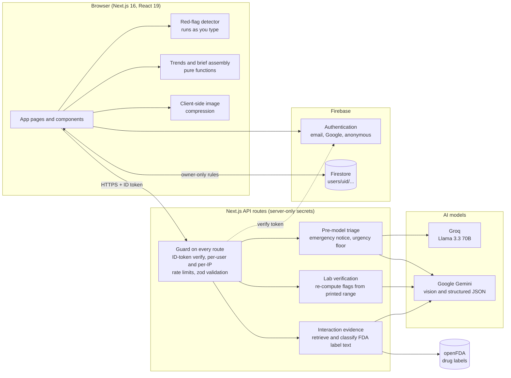
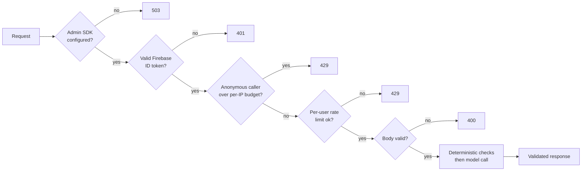
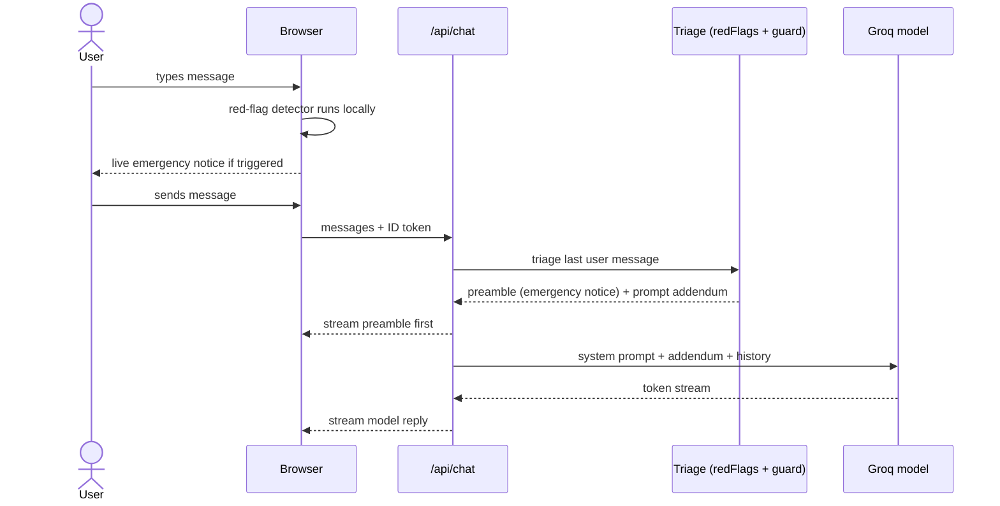
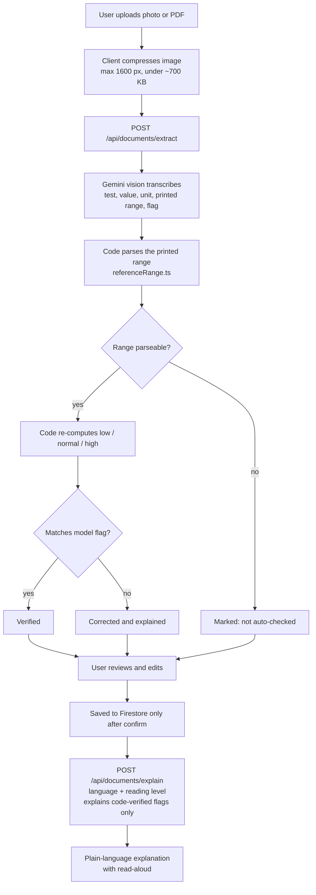
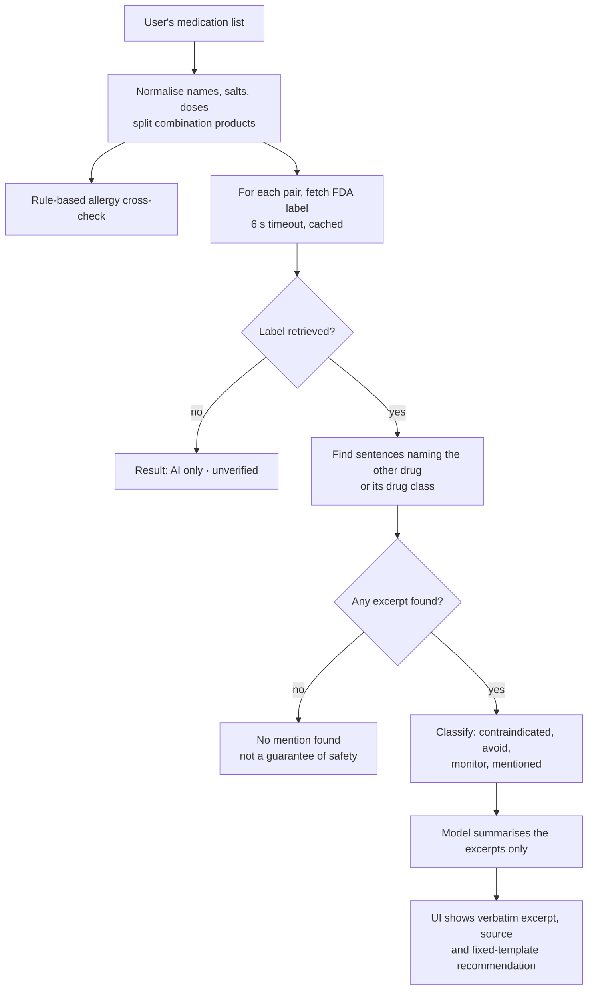
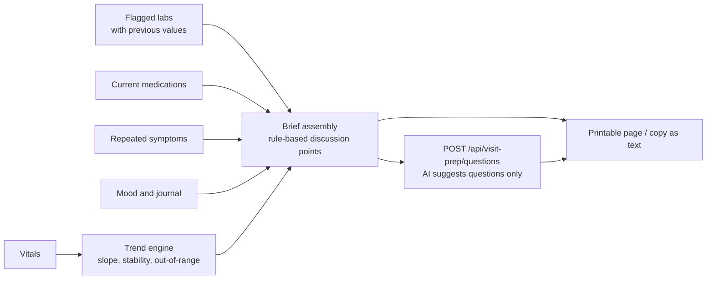
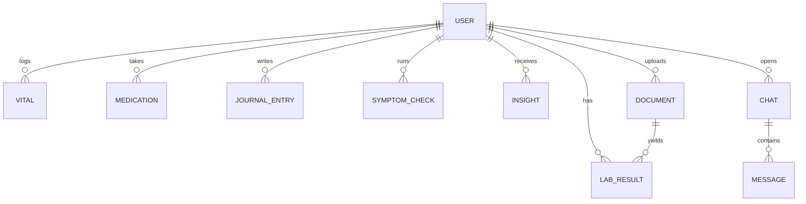

<div align="center">

# Vitalis

### An AI healthcare copilot with a deterministic trust layer

Every AI answer is **verified by code**, **grounded in a cited source**, or **clearly labelled as unverified**.


[Devpost](https://forgehacks-2026.devpost.com/) · [Quick start](#quick-start) · [Architecture](#architecture) · [The trust layer](#the-trust-layer)

</div>

> **Try it in 10 seconds:** open the app and click **Try the demo**. You land in a populated account for a fictional patient (rising blood pressure, flagged labs, warfarin and ibuprofen). No sign-up needed.

> **Disclaimer:** Vitalis provides general health information and organisational tools. It is not a medical device, does not diagnose, and is not a substitute for professional medical advice. In an emergency, call your local emergency number.

---

## Table of contents

1. [Hackathon submission](#hackathon-submission)
2. [Problem statement and target users](#problem-statement-and-target-users)
3. [Solution overview](#solution-overview)
4. [Features](#features)
5. [Architecture](#architecture)
6. [The trust layer](#the-trust-layer)
7. [Key flows](#key-flows)
8. [Technical approach and components](#technical-approach-and-components)
9. [Real-world impact](#real-world-impact)
10. [Built during ForgeHacks vs. pre-existing](#built-during-forgehacks-vs-pre-existing)
11. [Quick start](#quick-start)
12. [Environment variables](#environment-variables)
13. [Firebase setup](#firebase-setup)
14. [Scripts and testing](#scripts-and-testing)
15. [Project structure](#project-structure)
16. [API reference](#api-reference)
17. [Data model and security](#data-model-and-security)
18. [Deployment](#deployment)
19. [Limitations](#limitations)
20. [Roadmap](#roadmap)
21. [License](#license)

---

## Hackathon submission

| | |
| --- | --- |
| **Project** | Vitalis: AI healthcare copilot you can trust |
| **Event** | [ForgeHacks 2026](https://forgehacks-2026.devpost.com/) (Oct 3–10, 2026) |
| **Track** | AI + Healthcare |
| **Prompt** | *"Build an AI-powered solution that makes healthcare information and interactions clearer, more accessible, or easier to act on."* |
| **Source code** | This repository |
| **Architecture** | [Architecture](#architecture) section below, plus `docs/architecture.png` |
| **Live demo** | Add your deployed URL here |
| **Demo video** | Add your video link here |

---

## Problem statement and target users

Health information is available but rarely usable.

- A **lab report** is a table of numbers and abbreviations. People leave appointments unsure what was said, and many cannot read the report's language comfortably.
- Most people take **more than one medicine** and have no easy way to know whether two of them clash.
- **Appointments are short.** People forget the symptom that mattered or the trend they noticed weeks ago.
- A generic chatbot answers from memory, and in medicine a **fluent, confident, wrong answer is the worst failure**. When someone types "chest pain" into an AI app, the response must never depend on whether a language model happens to behave.

**Who it is for**

| User | Need |
| --- | --- |
| People managing long-term conditions or several medicines | One place to track vitals and medications, with interaction checks they can trust |
| Patients with low health literacy or a different first language | Lab reports explained in plain language, in their language, read aloud |
| Caregivers | A clear, printable summary to bring to a doctor |
| Anyone with a sudden symptom | A fast, reliable emergency notice that does not depend on an AI model |

---

## Solution overview

Most health-AI projects are a prompt in front of a model. Vitalis wraps the models in a **deterministic trust layer**:

- **Models read and write.** They transcribe a report, phrase an explanation, summarise retrieved text, and suggest questions.
- **Code decides.** Emergencies, lab flags, interaction evidence, trends and urgency floors are computed by tested functions.
- **The UI says which is which.** Results are tagged as verified, corrected, grounded in an FDA label, or "AI only · unverified".

| Healthcare prompt | How Vitalis answers it |
| --- | --- |
| **Clearer** | Plain-language lab explainer in 9 languages and two reading levels, with read-aloud. Code re-computes every low/normal/high flag from the range printed on the report. |
| **More accessible** | Region-aware emergency numbers, one-click demo with no account, multilingual and right-to-left support, and read-aloud for low-literacy and low-vision users. |
| **Easier to act on** | A printable Visit Prep brief, and FDA-grounded medication safety that shows the verbatim label excerpt and its source. |

---

## Features

| Area | What it does |
| --- | --- |
| **Dashboard** | Health score with breakdown, vitals stat cards, logging streak, upcoming doses, latest AI insight, onboarding checklist. |
| **AI Copilot** | Chat in **Quick** (Groq, Llama 3.3 70B) or **Deep** (Google Gemini) mode, with per-user thread history and a live emergency notice as you type. |
| **Symptom Checker** | Interactive 3D body map leads to a structured assessment with urgency, red flags and self-care tips. Urgency is enforced by code. |
| **Documents** | Upload a photo or PDF of a lab report or prescription, review and edit the extracted data, and save only after you confirm. |
| **Lab explainer** | Plain-language explanation in English, Hindi, Spanish, Bengali, Tamil, Marathi, French, Portuguese and Arabic (RTL), with reading-level choice and read-aloud. |
| **Medications** | Dose and schedule tracking, adherence ring, FDA-grounded interaction check, rule-based allergy cross-check. |
| **Vitals** | Log readings, view charts and trend statistics. |
| **Journal** | Mood and notes with a mood heatmap and AI summaries. |
| **Insights** | Weekly AI insight built from your own logged data. |
| **Visit Prep** | One-page brief of the last 30 days that you can print or copy as text. |
| **Emergency access** | Region-aware emergency call button throughout the app. |
| **Demo mode** | Anonymous session with a seeded fictional patient and a bundled sample lab report. |

---

## Architecture


The same system as an editable diagram:



**Request pipeline.** Every AI route runs the same ordered checks before any model is called.



---

## The trust layer

The deterministic modules live in `src/lib` and are covered by tests in `tests/`.

| Concern | Module | What the code does | What the model does |
| --- | --- | --- | --- |
| **Emergencies** | `lib/safety/redFlags.ts`, `lib/safety/guard.ts` | Detects 11 red-flag categories (cardiac, respiratory, stroke, bleeding, overdose, anaphylaxis, mental health, seizure, head injury, sepsis, unresponsive) with negation handling and region-aware emergency numbers. Runs in the browser while you type and on the server **before** any model call. Symptom-checker urgency is floored in code, and a rule-based emergency result is returned even if the model is down. | Supportive follow-up after the notice. |
| **Lab values** | `lib/labs/referenceRange.ts` | Parses real-world range formats (`70-99`, `< 5.7`, `≥60`, `4,500-11,000`, decimal commas) and re-computes each flag from the range printed on that report. Disagreements are corrected and shown. Unparseable ranges are marked "not auto-checked". | Transcribes the report image. |
| **Drug interactions** | `lib/drugs/names.ts`, `lib/drugs/openfda.ts` | Normalises names, salts and doses, splits combination products, maps drugs to classes, and retrieves real FDA label sentences that mention the other drug or its class. Evidence is shown verbatim with its source and classified (contraindicated, avoid, monitor, mentioned). Recommendations are fixed templates. | One-sentence plain-language summary of the excerpts it was given. |
| **Trends and brief** | `lib/trends.ts`, `lib/visitBrief.ts` | Least-squares trends, stability bands, out-of-range counts and discussion points. | Phrases suggested questions from the facts. |
| **Abuse protection** | `lib/rateLimit.ts`, `lib/api/guard.ts` | Per-user limits on every AI route, plus per-IP limits for anonymous demo sessions, so fresh anonymous accounts cannot burn the AI quota. | n/a |

### Designed failure modes

| Situation | Behaviour |
| --- | --- |
| FDA lookup unavailable | Result is labelled **"AI only · unverified"**, never shown as verified. |
| No label mentions the other drug | The app says no mention was found and that this does not guarantee safety. It never says "safe". |
| Model returns malformed JSON | Rejected by zod validation instead of being rendered. |
| Model names a test that was not flagged | Filtered out server-side. |
| Model provider is down during an emergency | A rule-based emergency result is still returned. |

---

## Key flows

### 1. Emergency triage

The emergency notice is produced by code and streamed first, so urgent guidance never depends on the model.



### 2. Lab report verification and explanation



### 3. FDA-grounded interaction check



### 4. Visit Prep brief



---

## Technical approach and components

| Layer | Technology | Role |
| --- | --- | --- |
| Framework | Next.js 16 (App Router), React 19, TypeScript | Pages, server routes, streaming responses |
| UI | Tailwind CSS v4, Framer Motion, Lucide, IBM Plex and Space Grotesk | Design system and animation |
| 3D | three.js, `@react-three/fiber`, `drei`, `postprocessing` | Body map and visuals |
| Charts | Recharts | Vitals and lab trend charts |
| State and forms | Zustand, React Hook Form, zod | Toasts, forms, runtime validation |
| Auth and data | Firebase Auth, Firestore, Firebase Admin SDK | Accounts, per-user data, server token verification |
| LLMs | Groq (`llama-3.3-70b-versatile`), Google Gemini (default `gemini-3.6-flash`) | Fast chat, vision, structured JSON, deep chat |
| Evidence | openFDA drug-label API | Public source for interaction excerpts |
| Testing | `node:test` via `tsx` | Unit tests for safety-critical logic |

**Design principles**

1. **Code before model.** Safety checks run first and do not depend on a model response.
2. **Models never get the last word on facts.** Flags, urgency and evidence are computed or retrieved, and the model only phrases or summarises.
3. **Say what you do not know.** Missing evidence is reported as missing, never as safe.
4. **Validate everything.** Inputs and model outputs are checked with zod.
5. **User stays in control.** Extracted data is saved only after review and confirmation.

---

## Real-world impact

- **Understanding:** patients get their own lab report in plain language and their own language, and can have it read aloud.
- **Safety:** an emergency notice is shown immediately and does not depend on an AI provider being up. Interaction checks show real label text instead of confident guesses.
- **Better visits:** a one-page brief turns a month of scattered logs into a clear conversation with a doctor.
- **Access:** no sign-up for the demo, free-tier AI providers, and a public drug-label source keep the barrier to entry low.
- **Trust:** the app is honest about what it verified, what it retrieved, and what it could not check.

---

## Built during ForgeHacks vs. pre-existing

Vitalis existed before the hackathon as a health-tracking app with AI chat, a 3D symptom checker and document upload. To comply with the ForgeHacks rules, here is exactly what is **new for this event**:

**New**
- Deterministic emergency red-flag engine, client-side live notice, server pre-LLM triage, urgency floor, model-outage fallback, region-aware emergency numbers (replaced hard-coded 911 in three places)
- Lab-range parser and code verification of AI-extracted flags, with verified, corrected and unverifiable UI
- Plain-language, multilingual, reading-level-aware report explainer with read-aloud
- FDA-label-grounded interaction checker (retrieval, drug classes, evidence UI), rule-based allergy cross-check, labelled fallback
- Visit Prep brief (trends engine, brief assembly, AI questions, print and copy)
- One-click demo mode (anonymous auth, seeded fictional patient, bundled sample lab report), per-IP abuse limits
- 54-test suite, architecture diagram, zod validation on new AI routes

**Pre-existing (not claimed as new):** Next.js app shell and design system, Firebase auth and Firestore data layer, vitals / medications / journal / insights pages, Groq and Gemini chat, 3D symptom checker and body map, document upload and extraction (before verification), landing page.

---

## Quick start

### Prerequisites

- Node.js 20 or newer
- A Firebase project
- A Groq API key and a Google Gemini API key (both have free tiers)

### Install and run

```bash
git clone https://github.com/vybex-dev/vitalis-health.git
cd vitalis-health
npm install
cp .env.example .env.local   # fill in the values (see below)
npm run dev                  # http://localhost:3000
```

Click **Try the demo** on the landing page to explore the seeded patient. The demo needs Anonymous sign-in enabled in Firebase.

---

## Environment variables

Copy `.env.example` to `.env.local`. On Vercel, add the same values under Project Settings → Environment Variables.

| Variable | Scope | Where to get it |
| --- | --- | --- |
| `NEXT_PUBLIC_FIREBASE_API_KEY` | Client | Firebase Console → Project settings → Your apps → Web app SDK config |
| `NEXT_PUBLIC_FIREBASE_AUTH_DOMAIN` | Client | Same as above |
| `NEXT_PUBLIC_FIREBASE_PROJECT_ID` | Client | Same as above |
| `NEXT_PUBLIC_FIREBASE_STORAGE_BUCKET` | Client | Same as above |
| `NEXT_PUBLIC_FIREBASE_MESSAGING_SENDER_ID` | Client | Same as above |
| `NEXT_PUBLIC_FIREBASE_APP_ID` | Client | Same as above |
| `NEXT_PUBLIC_USE_FIREBASE_EMULATORS` | Client | Set to `true` only when running the Firebase emulators locally |
| `FIREBASE_PROJECT_ID` | Server | Service account JSON |
| `FIREBASE_CLIENT_EMAIL` | Server | Service account JSON |
| `FIREBASE_PRIVATE_KEY` | Server | Service account JSON. Keep the `\n` escapes if pasted on one line |
| `GROQ_API_KEY` | Server | https://console.groq.com/keys |
| `GEMINI_API_KEY` | Server | https://aistudio.google.com/apikey |
| `GEMINI_MODEL` | Server, optional | Overrides the default Gemini model |

Never prefix server secrets with `NEXT_PUBLIC_`. An openFDA API key is optional.

---

## Firebase setup

1. Create a Firebase project.
2. Enable **Authentication** providers **Email/Password**, **Google** and **Anonymous** (Anonymous is required for the demo button).
3. Create a **Firestore** database.
4. Deploy the security rules:
   ```bash
   firebase deploy --only firestore:rules
   ```
   Or paste `firestore.rules` into Firebase Console → Firestore → Rules.
5. Add a **Web app** and copy its config into the `NEXT_PUBLIC_FIREBASE_*` variables.
6. Generate a **service account** key (Project settings → Service accounts) and copy `project_id`, `client_email` and `private_key` into the `FIREBASE_*` variables.
7. Optional: enable Firebase's automatic cleanup of anonymous accounts, because every demo session creates an anonymous user.

Uploaded documents are stored inline in Firestore, so Cloud Storage is not required. `storage.rules` is included (owner-only, deny-by-default) in case you enable Storage later.

---

## Scripts and testing

| Command | Description |
| --- | --- |
| `npm run dev` | Start the development server |
| `npm run build` | Production build |
| `npm start` | Run the production build |
| `npm run lint` | ESLint |
| `npm run typecheck` | TypeScript check (`tsc --noEmit`) |
| `npm test` | Run the test suite |
| `npm run check` | Typecheck, lint and tests together |

The suite has 54 tests across the pure-logic modules:

| File | Covers |
| --- | --- |
| `tests/redFlags.test.ts` | Emergency detection, including real emergency phrasings that must trigger and benign, negated or family-history phrasings that must not |
| `tests/guard.test.ts` | Pre-model chat triage and region handling |
| `tests/labs.test.ts` | Reference-range parsing and flagging, including the bundled sample report |
| `tests/drugs.test.ts` | Drug name normalisation, classes and allergy cross-check |
| `tests/visitBrief.test.ts` | Brief assembly and trend-based discussion points |

---

## Project structure

```
.
├── docs/                       Architecture diagram (png, svg)
├── public/samples/             Sample lab report used by the demo
├── src/
│   ├── app/
│   │   ├── page.tsx            Landing page
│   │   ├── (auth)/             Login and signup
│   │   ├── onboarding/         First-run profile setup
│   │   ├── (app)/              Authenticated pages
│   │   │   ├── dashboard/  chat/  vitals/  medications/
│   │   │   ├── symptom-checker/  documents/  journal/
│   │   │   └── insights/  visit-prep/  profile/
│   │   └── api/                Server routes (see API reference)
│   ├── components/
│   │   ├── ui/                 Design-system primitives
│   │   ├── landing/  layout/  auth/  chat/  dashboard/
│   │   ├── documents/  medications/  vitals/  journal/
│   │   └── safety/  symptom/  three/
│   ├── hooks/                  Data hooks (vitals, medications, journal, documents, chat, ...)
│   ├── lib/
│   │   ├── safety/             Red-flag detector and pre-model triage
│   │   ├── labs/               Reference-range parsing and verification
│   │   ├── drugs/              Name normalisation and openFDA evidence
│   │   ├── ai/                 Groq and Gemini clients, prompts, languages
│   │   ├── api/                Anonymous per-IP rate limiting
│   │   ├── firebase/           Client, admin and Firestore repository
│   │   ├── auth/               Auth context and useAuth
│   │   ├── demo/               Demo patient seed
│   │   └── trends.ts  visitBrief.ts  healthScore.ts  rateLimit.ts  ...
│   ├── store/                  Zustand toast store
│   └── types/                  Shared TypeScript types
├── tests/                      Unit tests
├── firestore.rules             Firestore security rules
├── storage.rules               Cloud Storage rules (optional)
└── firebase.json  firestore.indexes.json
```

---

## API reference

All routes require a signed-in Firebase user (anonymous demo users included), validate input, and are rate limited per user. Anonymous users also share a per-IP budget.

| Route | Purpose | Model | Limit |
| --- | --- | --- | --- |
| `POST /api/chat` | Quick copilot chat with pre-model triage (streamed) | Groq | 30 per 10 min |
| `POST /api/chat/deep` | Deep copilot chat | Gemini | 15 per 10 min |
| `POST /api/symptom-check` | Structured assessment with code-enforced urgency | Gemini | 12 per 10 min |
| `POST /api/documents/extract` | Transcribe a document, then verify lab flags in code | Gemini vision | 15 per 30 min |
| `POST /api/documents/explain` | Plain-language, multilingual lab explanation | Gemini | 10 per 30 min |
| `POST /api/medications/check-interactions` | FDA-grounded interaction and allergy check | Gemini (summary) | 10 per 10 min |
| `POST /api/insights/weekly` | Weekly AI insight | Gemini | 8 per 30 min |
| `POST /api/journal/summary` | Journal summary | Gemini | 8 per 30 min |
| `POST /api/visit-prep/questions` | Suggested questions for a doctor visit | Gemini | 10 per 30 min |

Error codes: `401` not signed in, `400` invalid body, `429` rate limited, `502` model or upstream failure, `503` server not configured.

---

## Data model and security



Everything a user owns lives under `users/{uid}` in Firestore (`vitals`, `medications`, `journal`, `symptomChecks`, `insights`, `documents`, `labResults`, `chats/{chatId}/messages`).

- **Firestore rules:** only the authenticated owner can read or write their subtree. No collection is publicly readable and there is no cross-user access.
- **Documents:** stored inline as base64 on the document. Images are scaled to 1600 px and kept under about 700 KB on the client to stay below Firestore's 1 MB document limit.
- **Secrets:** Admin SDK and AI keys are server-only and never reach the browser.
- **Confirmation before saving:** extracted data is saved only after the user reviews it.

---

## Deployment

Vitalis deploys to Vercel with no extra configuration.

1. Push the repo to GitHub and import it in Vercel.
2. Add every variable from the [environment table](#environment-variables).
3. In Firebase → Authentication → Settings → **Authorized domains**, add your Vercel domain.
4. Deploy the Firestore rules (see [Firebase setup](#firebase-setup)).

`next.config.ts` keeps `firebase-admin` external so Next.js does not bundle it.

---

## Limitations

- **Not a medical device and not HIPAA-compliant.** A real deployment would need a BAA, audit logging, and clinical and legal review.
- The red-flag detector is **English-only pattern matching**. It is a safety floor beneath the model, not a replacement for clinical judgement, and it will miss unusual phrasings. Explanations can be produced in 9 languages, but emergency detection of non-English input is not implemented.
- Lab verification compares only against **the range printed on the report**. It does not apply its own clinical ranges and does not check categorical (`Negative`) or sex-specific ranges.
- Interaction checking depends on **openFDA label coverage and wording**. Absence of a mention is not evidence of safety, and the UI says so. Drug-class matching uses a small curated list.
- Translations are model-generated and should be reviewed by a native speaker before clinical use.
- The in-memory rate limiter does not share state across serverless instances. Use Redis or Upstash for strict limits.
- The app uses the `@google/generative-ai` SDK. Google now recommends `@google/genai` for new work.

---

## Roadmap

- [ ] Clinician-reviewed critical-value thresholds
- [ ] Emergency detection for non-English input
- [ ] Scheduled medication reminders
- [ ] Wearable sync
- [ ] FHIR import
- [ ] Pharmacist-reviewed interaction knowledge base
- [ ] Distributed rate limiting

---

## License

Copyright (c) 2026 Harsh Yadav. All Rights Reserved. See [LICENSE](./LICENSE).
