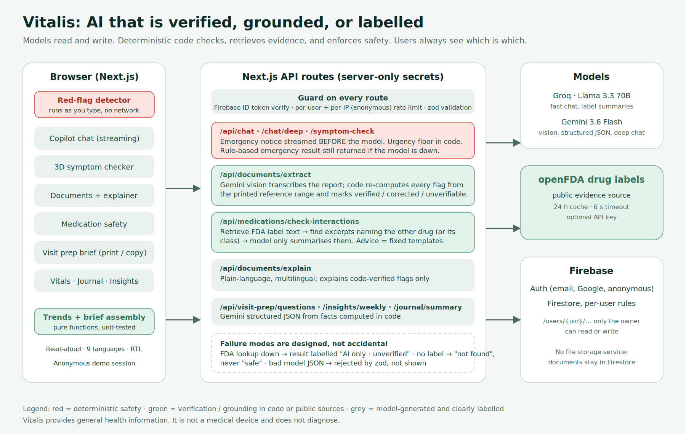

# Vitalis

**An AI healthcare copilot with a deterministic trust layer.**

**ForgeHacks 2026 · Track: AI + Healthcare** ([Devpost](https://forgehacks-2026.devpost.com/))
*Prompt: "Build an AI-powered solution that makes healthcare information and interactions clearer, more accessible, or easier to act on."*

> **Try it in 10 seconds:** open the app and click **"Try the demo"**. You land in a populated account for a fictional patient. No sign-up.

Vitalis helps people track their health, understand medical documents, check medication safety, and prepare for doctor visits. AI is used for language and summarisation. Safety-critical decisions (emergencies, lab flags, drug-interaction evidence, trends) are made by tested code, and the UI shows which is which.

> **Disclaimer:** Vitalis provides general health information and organisational tools. It is not a medical device, does not diagnose, and is not a substitute for professional medical advice. In an emergency, call your local emergency number.



---

## Table of contents

1. [Why Vitalis](#why-vitalis)
2. [Built during ForgeHacks vs. pre-existing](#built-during-forgehacks-oct-310-2026-vs-pre-existing)
3. [Features](#features)
4. [The trust layer](#the-trust-layer)
5. [Tech stack](#tech-stack)
6. [Getting started](#getting-started)
7. [Environment variables](#environment-variables)
8. [Firebase setup](#firebase-setup)
9. [Scripts and testing](#scripts-and-testing)
10. [Project structure](#project-structure)
11. [API routes](#api-routes)
12. [Data model and security](#data-model-and-security)
13. [Deployment](#deployment)
14. [Limitations](#limitations)
15. [Roadmap](#roadmap)
16. [License](#license)

---

## Why Vitalis

Health information is available but hard to use:

- A lab report is a table of numbers and abbreviations, often in a language the patient doesn't read comfortably.
- Many people take several medicines and have no easy way to know whether two of them clash.
- Appointments are short, and people forget the symptom or trend that mattered.
- A generic chatbot can give a fluent, confident, wrong answer. In health, that is the worst failure.

Vitalis puts deterministic checks around the models, so every AI output is **verified by code**, **grounded in a cited source**, or **labelled as unverified**.

---

## Built during ForgeHacks (Oct 3–10, 2026) vs. pre-existing

Vitalis existed before the hackathon as a health-tracking app with AI chat, a 3D symptom checker and document upload. To comply with the ForgeHacks rules, here is exactly what is **new for this event**:

**New**
- Deterministic emergency red-flag engine, client-side live notice, server pre-LLM triage, urgency floor, model-outage fallback, region-aware emergency numbers (replaced hard-coded 911 in three places)
- Lab-range parser and code verification of AI-extracted flags, with verified/corrected/unverifiable UI
- Plain-language, multilingual, reading-level-aware report explainer with read-aloud
- FDA-label-grounded interaction checker (retrieval, drug classes, evidence UI), rule-based allergy cross-check, labelled fallback
- Visit Prep brief (trends engine, brief assembly, AI questions, print/copy)
- One-click demo mode (anonymous auth, seeded fictional patient, bundled sample lab report), per-IP abuse limits
- 54-test suite, architecture diagram, zod validation on new AI routes

**Pre-existing (not claimed as new):** Next.js app shell and design system, Firebase auth/Firestore data layer, vitals / medications / journal / insights pages, Groq + Gemini chat, 3D symptom checker and body map, document upload + extraction (before verification), landing page.

---

## Features

| Area | What it does |
| --- | --- |
| **Dashboard** | Health score with a breakdown, vitals stat cards, logging streak, upcoming medication doses, latest AI insight, and an onboarding checklist. |
| **AI Copilot** | Chat with two modes: **Quick** (Groq, Llama 3.3 70B) and **Deep** (Google Gemini). Per-user thread history. A live emergency notice appears as you type. |
| **Symptom Checker** | Interactive 3D body map leads to a structured assessment: urgency, red flags and self-care tips. Urgency is enforced by code. |
| **Documents** | Upload a photo or PDF of a lab report or prescription. Review and edit the extracted data, and it is saved only after you confirm. |
| **Lab explainer** | Plain-language explanation in 9 languages (English, Hindi, Spanish, Bengali, Tamil, Marathi, French, Portuguese, Arabic with RTL), with a reading-level choice and read-aloud through the browser's speech synthesis. |
| **Medications** | Dose and schedule tracking, adherence ring, FDA-grounded interaction check, and a rule-based allergy cross-check. |
| **Vitals** | Log readings and view charts with trend statistics. |
| **Journal** | Mood and notes with a mood heatmap and AI summaries. |
| **Insights** | Weekly AI insight built from your own logged data. |
| **Visit Prep** | One-page brief of the last 30 days (medications, vital trends, flagged labs, repeated symptoms, mood) that you can print or copy as text. The AI only suggests questions to ask. |
| **Emergency access** | Region-aware emergency call button available throughout the app. |
| **Demo mode** | One click signs you into a populated account for a fictional patient, with no sign-up. |
| **Auth** | Email/password, Google sign-in, and anonymous sessions for the demo. |

---

## The trust layer

The deterministic modules are in `src/lib` and are covered by tests in `tests/`.

| Concern | Module | What the code does | What the model does |
| --- | --- | --- | --- |
| **Emergencies** | `lib/safety/redFlags.ts`, `lib/safety/guard.ts` | Detects 11 red-flag categories (cardiac, respiratory, stroke, bleeding, overdose, anaphylaxis, mental health, seizure, head injury, sepsis, unresponsive) with negation handling and region-aware emergency numbers. Runs in the browser while you type and on the server **before** any model call. Symptom-checker urgency is floored in code, and a rule-based emergency result is returned even if the model is down. | Supportive follow-up after the notice. |
| **Lab values** | `lib/labs/referenceRange.ts` | Parses real-world range formats (`70-99`, `< 5.7`, `≥60`, `4,500-11,000`, decimal commas) and re-computes every low/normal/high flag from the range printed on the report. Disagreements are corrected and shown. Ranges that can't be parsed are marked "not auto-checked". | Transcribes the report image. |
| **Drug interactions** | `lib/drugs/names.ts`, `lib/drugs/openfda.ts` | Normalises names, salts and doses, splits combination products, maps drugs to classes, and retrieves real FDA drug-label sentences that mention the other drug or its class. Evidence is shown verbatim with its source and classified (contraindicated / avoid / monitor / mentioned). Recommendations are fixed templates. | One-sentence plain-language summary of the excerpts it was given. |
| **Trends and brief** | `lib/trends.ts`, `lib/visitBrief.ts` | Least-squares trends, stability bands, out-of-range counts and discussion points. | Phrases suggested questions from the facts. |
| **Abuse protection** | `lib/rateLimit.ts`, `lib/api/guard.ts` | Per-user limits on every AI route, plus per-IP limits for anonymous demo sessions. | n/a |

**Designed failure modes**

- FDA lookup unavailable: the result is labelled **"AI only · unverified"**, never shown as verified.
- No label mentions the other drug: the app says no mention was found and that this does not guarantee safety. It never says "safe".
- Model returns malformed JSON: it is rejected by zod validation instead of being rendered.
- Model names a test that wasn't actually flagged: it is filtered out server-side.

---

## Tech stack

| Layer | Technology |
| --- | --- |
| Framework | Next.js 16 (App Router), React 19, TypeScript |
| Styling and UI | Tailwind CSS v4, Framer Motion, Lucide icons, IBM Plex and Space Grotesk fonts |
| 3D | three.js, `@react-three/fiber`, `@react-three/drei`, `@react-three/postprocessing` |
| Charts | Recharts |
| State and forms | Zustand, React Hook Form, zod |
| Backend services | Firebase Auth, Firestore, Cloud Storage, Firebase Admin SDK |
| AI | Groq (`llama-3.3-70b-versatile`), Google Gemini (default `gemini-3.6-flash`, override with `GEMINI_MODEL`) |
| Drug data | openFDA drug labels |
| Testing | `node:test` via `tsx` |

---

## Getting started

### Prerequisites

- Node.js 20 or newer
- A Firebase project
- A Groq API key and a Google Gemini API key (both have free tiers)

### Install and run

```bash
git clone https://github.com/vybex-dev/vitalis-health.git
cd vitalis-health
npm install
cp .env.example .env.local   # then fill in the values (see below)
npm run dev                  # http://localhost:3000
```

Open the app and click **Try the demo** to explore a pre-populated account for a fictional patient (rising blood pressure, flagged labs, warfarin and ibuprofen). The demo needs Anonymous sign-in enabled in Firebase.

---

## Environment variables

Copy `.env.example` to `.env.local`. On Vercel, add the same values under Project Settings → Environment Variables.

| Variable | Scope | Where to get it |
| --- | --- | --- |
| `NEXT_PUBLIC_FIREBASE_API_KEY` | Client | Firebase Console → Project settings → Your apps → Web app SDK config |
| `NEXT_PUBLIC_FIREBASE_AUTH_DOMAIN` | Client | Same as above |
| `NEXT_PUBLIC_FIREBASE_PROJECT_ID` | Client | Same as above |
| `NEXT_PUBLIC_FIREBASE_STORAGE_BUCKET` | Client | Same as above |
| `NEXT_PUBLIC_FIREBASE_MESSAGING_SENDER_ID` | Client | Same as above |
| `NEXT_PUBLIC_FIREBASE_APP_ID` | Client | Same as above |
| `NEXT_PUBLIC_USE_FIREBASE_EMULATORS` | Client | Set to `true` only when running the Firebase emulators locally |
| `FIREBASE_PROJECT_ID` | Server | Service account JSON |
| `FIREBASE_CLIENT_EMAIL` | Server | Service account JSON |
| `FIREBASE_PRIVATE_KEY` | Server | Service account JSON. Keep the `\n` escapes if you paste it on one line |
| `GROQ_API_KEY` | Server | https://console.groq.com/keys |
| `GEMINI_API_KEY` | Server | https://aistudio.google.com/apikey |
| `GEMINI_MODEL` | Server, optional | Overrides the default Gemini model |

Never prefix server secrets with `NEXT_PUBLIC_`.

---

## Firebase setup

1. Create a Firebase project.
2. Enable **Authentication** providers: **Email/Password**, **Google** and **Anonymous** (Anonymous is required for the demo button).
3. Create a **Firestore** database and a **Cloud Storage** bucket.
4. Deploy the rules in this repo:
   ```bash
   firebase deploy --only firestore:rules,storage
   ```
   (Or paste `firestore.rules` and `storage.rules` into the Firebase Console.)
5. Add a **Web app** and copy its config into the `NEXT_PUBLIC_FIREBASE_*` variables.
6. Generate a **service account** key (Project settings → Service accounts) and copy `project_id`, `client_email` and `private_key` into the `FIREBASE_*` variables.
7. Optional: enable Firebase's automatic cleanup of anonymous accounts, because every demo session creates an anonymous user.

---

## Scripts and testing

| Command | Description |
| --- | --- |
| `npm run dev` | Start the development server |
| `npm run build` | Production build |
| `npm start` | Run the production build |
| `npm run lint` | ESLint |
| `npm run typecheck` | TypeScript check (`tsc --noEmit`) |
| `npm test` | Run the test suite |
| `npm run check` | Typecheck, lint and tests together |

The suite has 54 tests covering the pure-logic modules:

| File | Covers |
| --- | --- |
| `tests/redFlags.test.ts` | Emergency detection, including a set of real emergency phrasings that must trigger and benign, negated or family-history phrasings that must not |
| `tests/guard.test.ts` | Pre-model chat triage and region handling |
| `tests/labs.test.ts` | Reference-range parsing and flagging, including the bundled sample report |
| `tests/drugs.test.ts` | Drug name normalisation, classes and allergy cross-check |
| `tests/visitBrief.test.ts` | Brief assembly and trend-based discussion points |

---

## Project structure

```
.
├── docs/                       Architecture diagram (png, svg)
├── public/samples/             Sample lab report used by the demo
├── src/
│   ├── app/
│   │   ├── page.tsx            Landing page
│   │   ├── (auth)/             Login and signup
│   │   ├── onboarding/         First-run profile setup
│   │   ├── (app)/              Authenticated pages
│   │   │   ├── dashboard/  chat/  vitals/  medications/
│   │   │   ├── symptom-checker/  documents/  journal/
│   │   │   └── insights/  visit-prep/  profile/
│   │   └── api/                Server routes (see below)
│   ├── components/
│   │   ├── ui/                 Design-system primitives (Button, Card, Modal, ...)
│   │   ├── landing/  layout/  auth/  chat/  dashboard/
│   │   ├── documents/  medications/  vitals/  journal/
│   │   └── safety/  symptom/  three/   Emergency notice, urgency badge, 3D visuals
│   ├── hooks/                  Data hooks (vitals, medications, journal, documents, chat, ...)
│   ├── lib/
│   │   ├── safety/             Red-flag detector and pre-model triage
│   │   ├── labs/               Reference-range parsing and verification
│   │   ├── drugs/              Name normalisation and openFDA evidence
│   │   ├── ai/                 Groq and Gemini clients, system prompts, languages
│   │   ├── api/                Anonymous per-IP rate limiting
│   │   ├── firebase/           Client, admin and Firestore repository
│   │   ├── auth/               Auth context and useAuth
│   │   ├── demo/               Demo patient seed
│   │   └── trends.ts  visitBrief.ts  healthScore.ts  rateLimit.ts  ...
│   ├── store/                  Zustand toast store
│   └── types/                  Shared TypeScript types
├── tests/                      Unit tests
├── firestore.rules             Firestore security rules
├── storage.rules               Cloud Storage security rules
└── firebase.json  firestore.indexes.json
```

---

## API routes

All routes validate input, require an authenticated user, and are rate limited per user.

| Route | Purpose | Limit |
| --- | --- | --- |
| `POST /api/chat` | Quick copilot chat (Groq) with pre-model safety triage | 30 per 10 min |
| `POST /api/chat/deep` | Deep copilot chat (Gemini) | 15 per 10 min |
| `POST /api/symptom-check` | Structured symptom assessment with code-enforced urgency | 12 per 10 min |
| `POST /api/documents/extract` | Extract labs and medications from an uploaded document | 15 per 30 min |
| `POST /api/documents/explain` | Plain-language, multilingual lab explanation | 10 per 30 min |
| `POST /api/medications/check-interactions` | FDA-grounded interaction and allergy check | 10 per 10 min |
| `POST /api/insights/weekly` | Weekly AI insight | 8 per 30 min |
| `POST /api/journal/summary` | Journal summary | 8 per 30 min |
| `POST /api/visit-prep/questions` | Suggested questions for a doctor visit | 10 per 30 min |

The in-memory limiter is best effort per serverless instance. See [Limitations](#limitations).

---

## Data model and security

Everything a user owns lives under `users/{uid}` in Firestore:

```
users/{uid}
├── vitals/{id}
├── medications/{id}
├── journal/{id}
├── symptomChecks/{id}
├── insights/{id}
├── documents/{id}
├── labResults/{id}
└── chats/{chatId}/messages/{id}
```

- **Firestore rules:** only the authenticated owner can read or write their subtree. No collection is publicly readable, and there is no cross-user access.
- **Storage rules:** uploads live at `users/{uid}/documents/{docId}/{fileName}`, are owner-only, and are limited to files under 15 MB. All other paths are denied.
- **Secrets:** Admin SDK and AI keys are server-only and never exposed to the browser.
- **Confirmation before saving:** extracted document data is saved only after the user reviews and confirms it.

---

## Deployment

Vitalis deploys to Vercel with no extra configuration.

1. Push the repo to GitHub and import it in Vercel.
2. Add every variable from the [table above](#environment-variables).
3. In Firebase → Authentication → Settings → **Authorized domains**, add your Vercel domain.
4. Deploy the Firestore and Storage rules (see [Firebase setup](#firebase-setup)).

`next.config.ts` keeps `firebase-admin` external so Next.js doesn't bundle it.

---

## Limitations

- **Not a medical device and not HIPAA-compliant.** A real deployment would need a BAA, audit logging, and clinical and legal review.
- The red-flag detector is **English-only pattern matching**. It is a safety floor beneath the model, not a replacement for clinical judgement, and it will miss unusual phrasings. Explanations can be produced in 9 languages, but emergency detection of non-English input is not implemented.
- Lab verification compares only against **the range printed on the report**. It does not apply its own clinical ranges and does not check categorical (`Negative`) or sex-specific ranges.
- Interaction checking depends on **openFDA label coverage and wording**. Absence of a mention is not evidence of safety, and the UI says so. Drug-class matching uses a small curated list.
- Translations are model-generated and should be reviewed by a native speaker before clinical use.
- The in-memory rate limiter does not share state across serverless instances. Use Redis or Upstash for strict limits.
- The app uses the `@google/generative-ai` SDK. Google now recommends `@google/genai` for new work.

---

## Roadmap

- Clinician-reviewed critical-value thresholds
- Emergency detection for non-English input
- Medication reminders (scheduled)
- Wearable sync
- FHIR import
- Pharmacist-reviewed interaction knowledge base
- Distributed rate limiting

---

## License

Copyright (c) 2026 Harsh Yadav. All Rights Reserved. See [LICENSE](./LICENSE).
